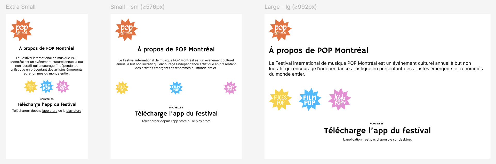

# Exercice Media Queries 1

## Installation

1. Cloner le repository
2. Ouvrir le dossier avec Visual Studio Code
3. Ouvrir une fenêtre de terminal dans Visual Studio Code et entrer la commande suivante :

```bash
npm install
```

## Travail

Depuis le terminal, entrer la commande suivante :

```bash
npm run dev
```

## Consigne

Intégrer [la maquette Figma](https://www.figma.com/design/7joOHBU1Xc9kVlecxBMsa9/imd2-exercice-media-queries-1?node-id=1-235&m=dev). À l'aide de **media queries**, faire en sorte que les éléments changent en fonction de la largeur de l'écran.

☝️ Vous n'avez pas besoin de modifier le HTML.

☝️ Les Google Fonts sont déjà chargées.

☝️ Le plus simple est de commencer par intégrer la version _Extra Small_ et de faire les adaptations pour les autres versions dans un deuxième temps.

## Aperçu


